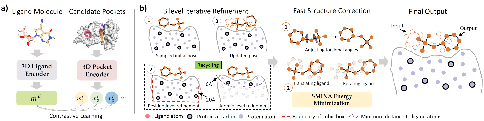

# DeltaDock

DeltaDock: A Unified Framework for Accurate, Efficient, and Physically Reliable Molecular Docking

This is a PyTorch implementation of DeltaDock for the robust and versatile molecular docking. If you encounter any issues, please reach out to jiaxianyan@mail.ustc.edu.cn.




## Installation
### Installation of the python dependencies
We provide a script **conda_env.sh** that makes it easy to install the python dependencies of DeltaDock. You just need to modify several packages according to you cuda version.
```
conda create -y -n torch_geo python=3.7
conda activate torch_geo
bash conda_env.sh
```